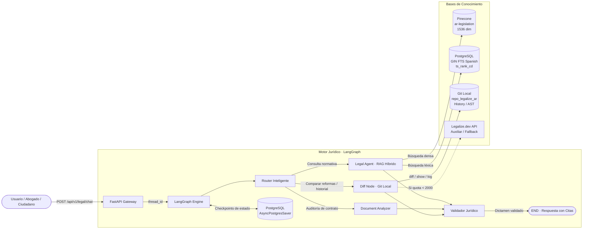

# ⚖️ Legalar · Asistente Legal y Motor RAG de Producción

<p align="center">
  <a href="https://legalar.onys.app" target="_blank">
    
  </a>
  
  
  
  
  
  
</p>

> 🌐 **Chat en Producción & Aplicación Web**: [https://legalar.onys.app](https://legalar.onys.app)

Sistema conversacional y motor de análisis normativo de grado de producción especializado en **Derecho Positivo Argentino**. La arquitectura utiliza como fuente primaria de verdad el repositorio versionado **`legalize-dev/legalize-ar`** (~31.326 normas consolidadas en Markdown y versionadas en Git).

La orquestación se basa en **LangGraph** bajo un flujo desacoplado: un **Ruteador Inteligente** clasifica la consulta mediante Structured Output estricto (Pydantic v2) hacia nodos de ejecución especializados:
- **`Legal Agent`**: Consultas doctrinales y normativas respaldadas por un pipeline de **RAG Híbrido** (búsqueda semántica en Pinecone + Full-Text Search en PostgreSQL con índice GIN en español y fusión RRF).
- **`Document Analyzer`**: Auditoría de contratos, convenios y cartas documento (PDF, DOCX, TXT) contrastados contra normas de orden público.
- **`Diff Node`**: Comparador histórico de reformas legislativas (ej: impacto del DNU 70/2023 sobre el Código Civil y Comercial y la Ley de Contrato de Trabajo) mediante un **motor Git local autónomo** con fallback de circuit-breaker sobre la API de Legalize.
- **`Legal Validator`**: Guardrail jurídico independiente que audita la suficiencia de la evidencia, mitiga alucinaciones y alerta si se alega la vigencia de normas derogadas.

La persistencia multi-turno se gestiona mediante un **Checkpointer asíncrono en PostgreSQL (`AsyncPostgresSaver`)** por `thread_id`.

---

## 🏛️ 1. Arquitectura y Principios de Diseño

El sistema opera bajo **Clean Architecture** y principios **SOLID**, garantizando bajo acoplamiento, alta cohesión y testeabilidad total.

```text
CHATBOT-LEGALIZE/
├── app/
│   ├── core/                  # Infraestructura: config, logging, telemetry, rate limiting, seguridad y factoría LLM
│   ├── domain/                # Dominio: enums de intenciones (QueryIntent), roles, confianzas y estados
│   ├── schemas/               # Contratos Pydantic v2 para API y agentes:
│   │   └── legal/             # DTOs de chat, citas normativas (LegalCitation), diffs y auditoría de contratos
│   ├── db/                    # Persistencia: SQLAlchemy 2.0 async (asyncpg), modelos legales (LegalLaw, LegalArticle, etc.)
│   ├── services/              # Casos de uso y lógica de negocio:
│   │   ├── legal/             # Parser Markdown InfoLEG, local Git diff engine, circuit breaker API, sync y RAG retriever
│   │   ├── llm_factory.py     # Factoría unificada con soporte automático para OpenAI y OpenRouter
│   │   ├── rag_service.py     # Cliente AsyncPinecone y generador de embeddings vectoriales
│   │   └── prompt_manager.py  # Versionado dinámico de directivas de agentes en base de datos
│   ├── agents/                # Grafo LangGraph:
│   │   └── legal/             # Router, LegalAgent, DocumentAnalyzer, DiffNode, Validator y StateGraph
│   └── api/                   # FastAPI Gateway: routers v1 (/legal, /ingest, /prompts, /admin, /health), middlewares y auth
├── data/                      # Almacenamiento local: golden_set.json y evaluation_results.json
├── scripts/                   # CLI de inicialización (init_db), bootstrap legal (legal_bootstrap) y evaluación (evaluate_rag)
├── tests/                     # Suite de pruebas automatizadas: unitarias, integración, seguridad y persistencia
├── Dockerfile                 # Contenedor multi-stage optimizado para Dokploy (con git y python 3.12)
├── docker-compose.yml         # Orquestación local (FastAPI, PostgreSQL 16, Redis, Phoenix opcional)
├── pyproject.toml             # Configuración unificada de herramientas de desarrollo
└── requirements.txt           # Dependencias fijadas para producción
```

---

## 🔄 2. Diagrama del Sistema Multi-Nodo Legal



---

## ⚡ 3. Motor de RAG Híbrido y Fusión RRF

Para garantizar máxima precisión en la recuperación de artículos jurídicos, el sistema combina:

1. **Búsqueda Léxica en PostgreSQL (FTS)**:
   - Los artículos se almacenan en la tabla `legal_articles` con un índice GIN sobre `to_tsvector('spanish', text_searchable)`.
   - Permite encontrar términos técnicos literales exactos (ej: *"pacto comisorio"*, *"locación habitacional"*, *"artículo 245"*).
2. **Búsqueda Vectorial Semántica en Pinecone**:
   - Embeddings de 1536 dimensiones generados vía **OpenRouter / OpenAI** (`openai/text-embedding-3-small`) en el namespace `ar-legislation`.
   - Permite capturar similitudes conceptuales aunque el usuario no use la terminología jurídica exacta.
3. **Reciprocal Rank Fusion (RRF)**:
   - Combina ambos rankings asignando un score compuesto:
     $$RRF(d) = \frac{W_{lex}}{k + rank_{lex}(d)} + \frac{W_{vec}}{k + rank_{vec}(d)}$$

---

## ⚖️ 4. Motor de Diffs y Fallback Autónomo

- El endpoint `/api/v1/legal/diff` compara versiones históricas de cualquier ley o artículo específico.
- **Fallback Circuit Breaker**: La API externa de `legalize.dev` tiene un límite gratuito mensual de 2.000 llamadas. El sistema cuenta con un monitor de consumo transparente: si la API alcanza su cupo o devuelve error `429 Too Many Requests`, el cliente conmuta de inmediato y de forma autónoma al **`LocalGitDiffEngine`**, que computa el diff sobre el repositorio Git local sin interrumpir el servicio ni generar costos.

---

## 🚀 5. Puesta en Marcha Rápida

### Requisitos previos
- Python 3.12+
- PostgreSQL 16+
- Redis 7+
- Clave de API de **OpenRouter** (o OpenAI) y **Pinecone**

### Configuración del entorno (`.env`)
```env
# === Proveedor LLM / OpenAI / OpenRouter ===
OPENAI_API_KEY=sk-or-v1-tu-clave-aqui
OPENAI_BASE_URL=https://openrouter.ai/api/v1
OPENAI_CHAT_MODEL=openai/gpt-4o-mini
OPENAI_EMBEDDING_MODEL=openai/text-embedding-3-small
LLM_TEMPERATURE=0.0

# === Pinecone ===
PINECONE_API_KEY=pcsk_tu-clave-aqui
PINECONE_INDEX_NAME=intelligence-system-legal

# === Postgres ===
POSTGRES_HOST=localhost
POSTGRES_PORT=5432
POSTGRES_DB=intelligence_system
POSTGRES_USER=postgres
POSTGRES_PASSWORD=tu-password

# === Redis ===
REDIS_HOST=localhost
REDIS_PORT=6379
```

### Inicialización de Base de Datos y Poblado de Leyes

1. **Crear esquema, tablas y prompts**:
   ```bash
   python -m scripts.init_db
   ```

2. **Ingestar las 10 leyes estructurales argentinas**:
   ```bash
   # Con generación de vectores en Pinecone (OpenRouter):
   python -m scripts.legal_bootstrap --priority

   # O modo offline ultra-rápido (solo PostgreSQL FTS, sin consumir tokens):
   python -m scripts.legal_bootstrap --priority --skip-embeddings
   ```

3. **Iniciar el servidor API**:
   ```bash
   uvicorn app.main:asgi_app --host 0.0.0.0 --port 8000 --reload
   ```
   Swagger UI interactivo disponible en: `http://localhost:8000/docs`

---

## 🐳 6. Despliegue con Docker Compose

La API está completamente empaquetada para correr como servicio autónomo e independiente:
- **Exposición Configurable de la API**: Mediante la variable `API_PORT` en el archivo `.env` (por defecto `8000`), podés exponer el puerto de la API al exterior o vincularlo localmente:
  ```env
  API_PORT=8000
  ```
- **Rate Limiting Defensivo en Redis**:
  - Límite por IP de 15 solicitudes por minuto en `/api/v1/legal/chat`, `/api/v1/legal/analyze` y `/api/v1/legal/diff`.
  - Ante excesos, responde con `HTTP 429 Too Many Requests` y cabecera `Retry-After`.
- **Soporte para Reverse Proxy**: Si utilizás Nginx, Caddy o Cloudflare por delante, el backend respeta automáticamente las cabeceras `X-Forwarded-For` y `X-Real-IP`.

### 🚀 Despliegue de la API con Docker Compose

```bash
# 1. Clonar el repositorio y configurar variables de entorno
cp .env.example .env

# 2. Levantar los servicios de backend (PostgreSQL 16, Redis 7, API FastAPI, Worker de Ingesta, Phoenix)
docker compose up -d --build

# 3. Inicializar esquemas e ingesta inicial de leyes prioritarias
docker compose exec api python -m scripts.init_db
docker compose exec api python -m scripts.legal_bootstrap --priority --skip-embeddings
```

La API estará lista y accesible en: **`http://localhost:8000`** (o el puerto configurado en `API_PORT`).
Documentación Swagger interactiva: `http://localhost:8000/docs`.

### 💻 Desarrollo Local Rápido (Sin Docker)

```bash
# Iniciar la API FastAPI
uvicorn app.main:asgi_app --host 127.0.0.1 --port 8000 --reload
```

### ☁️ Despliegue en Dokploy

1. En Dokploy, configurar el despliegue de la aplicación apuntando al repositorio de Git.
2. Definir las variables de entorno en el panel de Dokploy basándote en `.env.example`.
3. En la consola del contenedor API, inicializar esquema y leyes:
   ```bash
   python -m scripts.init_db
   python -m scripts.legal_bootstrap --priority
   ```

### ⏰ Automatización de Actualizaciones Normativas (Cron Job Mensual)

El catálogo oficial de **InfoLEG / SAIJ** (Ministerio de Justicia) se consolida el **día 1 de cada mes**, y el repositorio upstream **`legalize-ar`** procesa las reformas legislativas e impactos normativos el **día 2 de cada mes**.

Para mantener el asistente legal permanentemente actualizado con las últimas leyes y decretos vigentes en producción de forma 100% autónoma, se recomienda configurar un **Cron Job mensual** (programado para el día 3 de cada mes):

#### Opción A: Vía Endpoint API (Recomendado en Producción / Dokploy)
El backend incluye un endpoint administrativo (`POST /api/v1/legal/sync`) que ejecuta la sincronización Git incremental, calcula los hashes de cada artículo y regenera embeddings **exclusivamente para los artículos modificados o leyes nuevas**:

```bash
# En el crontab de tu VPS/servidor (ejecutar 'crontab -e'):
# Se ejecuta el día 3 de cada mes a las 04:00 AM
0 4 3 * * curl -s -X POST https://legalar.onys.app/api/v1/legal/sync -H "X-API-Key: TU_API_KEY_ADMIN" > /dev/null 2>&1
```

#### Opción B: Vía Contenedor Docker
Si gestionas el host directamente:

```bash
# En el crontab del host:
0 4 3 * * docker exec -t $(docker ps -qf "name=api") python -m scripts.legal_bootstrap --priority
```
> **Nota técnica**: En el cron job periódico **no** se incluye el flag `--force`. De este modo, el comparador de `content_hash` omite instantáneamente los miles de artículos que no cambiaron y solo gasta tokens en los textos reformados por el Congreso o el Poder Ejecutivo.

---

## 🏆 7. Evaluación RAG (Golden Set & LLM-as-a-Judge)

Para validar objetivamente el rigor normativo y la fidelidad del pipeline, se utiliza un harness automatizado con **LLM-as-a-Judge** ([`scripts/evaluate_rag.py`](scripts/evaluate_rag.py)) contra el conjunto curado ([`data/golden_set.json`](data/golden_set.json)):

```bash
python -m scripts.evaluate_rag
```

Métricas evaluadas:
- **Faithfulness**: Evalúa que la respuesta afirme únicamente hechos respaldados en los artículos citados.
- **Answer Relevance**: Evalúa que responda de forma directa y fundada a la consulta planteada.
- **Validation Guardrail**: Verifica que no cite leyes derogadas (ej: rechazo de vigencia de la Ley 27.551 por aplicación del DNU 70/2023).

---

## 📚 8. Fuentes de Datos, Licencia y Atribución Obligatoria

### Licencia del Código Fuente (Apache 2.0 con Atribución Obligatoria)
El código de este motor y API se distribuye bajo los términos de la **[Apache License 2.0](LICENSE)**.

> **Cláusula de Atribución Obligatoria**: Conforme a la sección 4 de la Licencia Apache 2.0 y el archivo [`NOTICE`](NOTICE), cualquier persona o entidad que redistribuya, modifique, use o exponga esta API o software derivado (incluyendo servicios sobre redes o SaaS) **está legalmente obligada a preservar los avisos de derechos de autor y dar crédito y reconocimiento expreso a Onion Sistemas (https://onionsis.com) y al proyecto Legalar** (enlazando a https://github.com/iandiduch/Legalar y https://legalar.onys.app).

### Fuente Primaria Oficial de Leyes
- **InfoLEG / SAIJ**: Dirección Nacional del Sistema Argentino de Información Jurídica (SAIJ), dependiente del Ministerio de Justicia de la República Argentina.
  - Catálogo legislativo mensual: [datos.jus.gob.ar/dataset/base-de-datos-legislativos-infoleg](https://datos.jus.gob.ar/dataset/base-de-datos-legislativos-infoleg)
  - Portal oficial: [www.infoleg.gob.ar](https://www.infoleg.gob.ar)
  - Publicado bajo licencia Creative Commons Atribución 4.0 Internacional (CC-BY 4.0) (Resolución MINJUS 986/2016).

### Repositorio Git de Leyes
- Reconocimiento al proyecto de código abierto **[legalize-ar](https://github.com/legalize-dev/legalize-ar)** de la iniciativa **[Legalize](https://legalize.dev)** por la consolidación en Markdown y versionado Git de las normas.

---

## 🔍 9. Estructura del Corpus y Tipología de Normas

El corpus procesado en `repo_legalize_ar` clasifica el ordenamiento normativo nacional según los estándares de nomenclatura de InfoLEG:

| Prefijo | Tipo de Norma | Ejemplo en Corpus |
|---|---|---|
| `LEY-XXXXX` | Leyes de la Nación | `ar/LEY-26994.md` (Código Civil y Comercial), `ar/LEY-20744.md` (LCT) |
| `LEY-24430` | Constitución Nacional | `ar/LEY-24430.md` (Texto oficial ordenado tras la Reforma de 1994) |
| `DNU-N-YYYY` | Decretos de Necesidad y Urgencia | `ar/DNU-70-2023.md` (Bases para la Reconstrucción de la Economía) |
| `DEC-N-YYYY` | Decretos Reglamentarios y del P.E.N. | `ar/DEC-222-2003.md` |
| `DL-N-YYYY` | Decretos-Leyes de facto | Normas con fuerza de ley dictadas en períodos de facto |

### Calidad de Reconstrucción Histórica (`reform_quality`)
Cada norma incluye en su frontmatter estructurado el grado de fidelidad de su trazabilidad Git:
- **`clean`**: La cadena de reformas y commits converge con exactitud matemática al texto consolidado vigente.
- **`partial`**: Ciertas reformas intermedias no pudieron resolverse mecánicamente; el commit de cabecera alinea con el texto consolidado oficial.
- **`bootstrap-only`**: Contiene únicamente el texto original y la consolidación actual.

---

## ⚠️ 10. Limitaciones Conocidas del Dataset

- **Anexos y Tablas en Formato Imagen**: Tablas tarifarias o escalas numéricas publicadas históricamente como imágenes escaneadas en InfoLEG (ej: anexos de la Ley 27.430) son omitidas en el parseo a texto Markdown (indicadas bajo `extra.images_dropped`).
- **Resoluciones de Actualización Numérica**: Resoluciones administrativas que actualizan montos variables (como límites de capital de la Ley 19.550 o topes de multas por inflación) no modifican el articulado formal en V1.
- **Ventana de Actualización**: El catálogo oficial InfoLEG se regenera el día 1 de cada mes y `legalize-ar` se actualiza el día 2. La sincronización incremental (`POST /api/v1/legal/sync`) opera en concordancia con este ciclo mensual.
- **Alcance Territorial V1**: Abarca la legislación nacional de la República Argentina. La legislación provincial (23 provincias y CABA) forma parte del roadmap para V2.

---

## ⚖️ 11. Descargo de Responsabilidad (Legal Disclaimer)

> **AVISO LEGAL:** Este sistema de Inteligencia Artificial y motor de RAG legal tiene fines exclusivamente informativos, pedagógicos y de apoyo a la investigación jurídica. Las respuestas generadas por los modelos de lenguaje, el análisis de contratos y las citas normativas suministradas no constituyen dictamen jurídico vinculante, ni asesoramiento legal formal, ni sustituyen en ningún caso el criterio, análisis ni patrocinio letrado obligatorio de un abogado profesional matriculado en la jurisdicción competente. Ni los desarrolladores ni los proveedores de datos asumen responsabilidad por decisiones legales, contractuales o judiciales adoptadas con base en la información brindada por esta herramienta.

