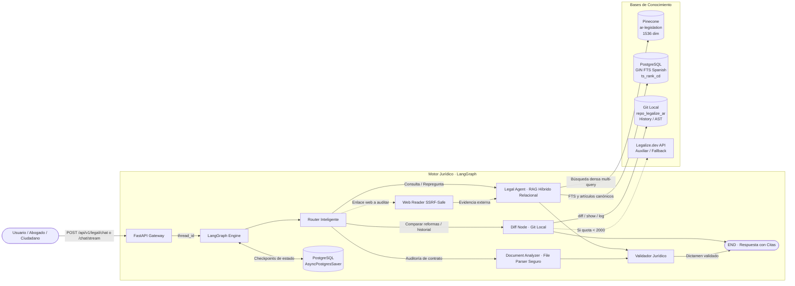
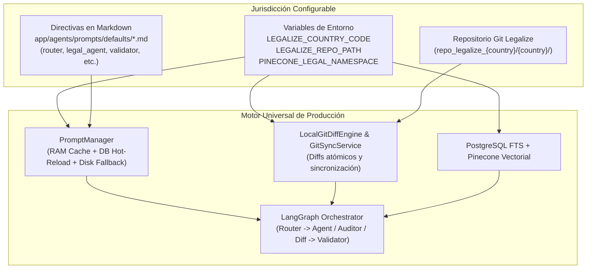

# ⚖️ Legalar · Asistente Legal y Motor RAG de Producción

<p align="center">
  <a href="https://legalar.onys.app" target="_blank">
    
  </a>
  
  
  
  
  
  
</p>

> 🌐 **Chat en Producción & Aplicación Web**: [https://legalar.onys.app](https://legalar.onys.app)

Sistema conversacional y motor de análisis normativo de grado de producción especializado en **Derecho Positivo Argentino**. La arquitectura utiliza como fuente primaria de verdad el repositorio versionado **`legalize-dev/legalize-ar`** (~31.326 normas consolidadas en Markdown y versionadas en Git).

La orquestación se basa en **LangGraph** bajo un flujo desacoplado: un **Ruteador Inteligente** clasifica la consulta mediante Structured Output estricto (Pydantic v2) hacia nodos de ejecución especializados:
- **`General Inquiry`**: Saludos, fórmulas de cortesía y preguntas sobre capacidades resueltas de forma instantánea sin latencia de búsqueda ni citas normativas innecesarias.
- **`Legal Agent`**: Consultas doctrinales y normativas respaldadas por un pipeline de **RAG Híbrido Relacional** (búsqueda semántica en Pinecone + Full-Text Search en PostgreSQL con índice GIN en español, expansión relacional de consultas multi-norma, formulación proactiva de preguntas de aclaración fáctica y fusión RRF).
- **`URL Fact-Checking`**: Auditoría de noticias y enlaces web externos bajo principio *zero-trust*, extrayendo el contenido de forma segura con protección SSRF y contrastándolo contra normas vigentes.
- **`Document Analyzer`**: Auditoría de contratos, convenios y cartas documento (PDF, DOCX, TXT) con defensas contra inyección de prompts, zip-slip y bombas de descompresión.
- **`Diff Node`**: Comparador histórico de reformas legislativas (ej: impacto del DNU 70/2023 sobre el Código Civil y Comercial y la Ley de Contrato de Trabajo) mediante un **motor Git local autónomo** con fallback de circuit-breaker sobre la API de Legalize.
- **`Legal Validator`**: Guardrail jurídico independiente que audita la suficiencia de la evidencia, mitiga alucinaciones y alerta si se alega la vigencia de normas derogadas.

La persistencia multi-turno se gestiona mediante un **Checkpointer asíncrono en PostgreSQL (`AsyncPostgresSaver`)** por `thread_id`.

---

## 🏛️ 1. Arquitectura y Principios de Diseño

El sistema opera bajo **Clean Architecture** y principios **SOLID**, garantizando bajo acoplamiento, alta cohesión y testeabilidad total.

```text
CHATBOT-LEGALIZE/
├── app/
│   ├── core/                  # Infraestructura: config, logging, telemetry, rate limiting, seguridad y factoría LLM
│   ├── domain/                # Dominio: enums de intenciones (QueryIntent), roles, confianzas y estados
│   ├── schemas/               # Contratos Pydantic v2 para API y agentes:
│   │   └── legal/             # DTOs de chat, citas normativas (LegalCitation), diffs y auditoría de contratos
│   ├── db/                    # Persistencia: SQLAlchemy 2.0 async (asyncpg), modelos legales (LegalLaw, LegalArticle, etc.)
│   ├── services/              # Casos de uso y lógica de negocio:
│   │   ├── legal/             # Parser InfoLEG, Git diff local, query expander relacional, web reader seguro, file parser, retriever y analysis worker
│   │   ├── llm_factory.py     # Factoría unificada con soporte automático para OpenAI y OpenRouter
│   │   ├── rag_service.py     # Cliente AsyncPinecone y generador de embeddings vectoriales
│   │   └── prompt_manager.py  # Versionado dinámico de directivas de agentes en base de datos
│   ├── agents/                # Grafo LangGraph:
│   │   └── legal/             # Router, LegalAgent, DocumentAnalyzer, DiffNode, Validator y StateGraph
│   └── api/                   # FastAPI Gateway: routers v1 (/legal, /ingest, /prompts, /admin, /health), middlewares y auth
├── data/                      # Almacenamiento local: golden_set.json y evaluation_results.json
├── scripts/                   # CLI de inicialización (init_db), bootstrap legal (legal_bootstrap) y evaluación (evaluate_rag)
├── tests/                     # Suite de pruebas automatizadas: unitarias (66 tests), integración, seguridad y persistencia
├── Dockerfile                 # Contenedor multi-stage optimizado para Dokploy (con git y python 3.12)
├── docker-compose.yml         # Orquestación local (FastAPI, PostgreSQL 16, Redis, Workers y Phoenix opcional)
├── pyproject.toml             # Configuración unificada de herramientas de desarrollo
└── requirements.txt           # Dependencias fijadas para producción
```

---

## 🔄 2. Diagrama del Sistema Multi-Nodo Legal



---

## ⚡ 3. Motor de RAG Híbrido Relacional y Fusión RRF

Para garantizar máxima precisión en la recuperación de artículos jurídicos y resolver consultas complejas que abarcan múltiples normas, el sistema opera bajo un pipeline en 4 capas:

1. **Query Rewriting Conversacional**:
   - Ante repreguntas o aclaraciones del usuario (*"no entendí"*, *"explicame mejor"*, *"¿por qué?"*), el LLM reescribe la consulta contextualizándola sobre el tema legal de fondo del historial, garantizando que el retriever busque normas sustantivas y no textos genéricos.
2. **Expansión Relacional Multi-Norma (`LegalQueryExpander`)**:
   - Resuelve el problema dogmático de la **asimetría semántica** entre la Parte Especial y la Parte General de los códigos. Por ejemplo, en la pregunta *"¿cuánto tarda en prescribir el fraude?"*, descompone la búsqueda en:
     - **Figura especial**: Delito de estafa y escala penal (Art. 172 CP).
     - **Regla general de cálculo**: Cómputo de la prescripción según el máximo de la pena fijada para el delito (Art. 62 CP).
     - **Causales dogmáticas**: Inicio del cómputo e interrupción/suspensión (Arts. 63 y 67 CP).
   - Identifica identificadores canónicos directos (`canonical_articles`, ej: `LEY-11179:62`, `LEY-11179:172`, `DEC-390-1976:245`).
3. **Recuperación Canónica Determinista & Multi-Query RRF**:
   - **Búsqueda Canónica Exacta**: `retrieve_exact_articles` consulta directamente por `(law_identifier, article_number)` en PostgreSQL garantizando 100% de precisión en normas clave.
   - **Búsqueda Concurrente**: `search_multi_query` ejecuta las sub-queries en paralelo vía `asyncio.gather`, combinando Búsqueda Léxica FTS en PostgreSQL (índice GIN `spanish` con `ts_rank_cd`) y Búsqueda Densa Semántica en Pinecone (1536 dim).
   - **Reciprocal Rank Fusion (RRF)**: Fusiona y deduplica los candidatos de todas las sub-queries asegurando que tanto la figura especial como las reglas generales alcancen el ranking superior:
     $$RRF(d) = \sum_{q \in Q} \left( \frac{W_{lex}}{k + rank_{lex}(d, q)} + \frac{W_{vec}}{k + rank_{vec}(d, q)} \right)$$
4. **Filtrado de Citaciones Utilizadas (Attribution De-Noising)**:
   - Elimina de raíz el *citation bloat*: coteja los artículos recuperados contra `articles_referenced` y las menciones textuales del dictamen generado.
   - El cliente y el frontend reciben **únicamente las citas que efectivamente fundamentaron la respuesta**, evitando mostrar 10 fuentes cuando solo se emplearon 3 o 4.

---

## 🛡️ 4. Motor de Diffs y Seguridad Defensiva

### Motor de Diffs Autónomo
- El endpoint `/api/v1/legal/diff` compara versiones históricas de cualquier ley o artículo específico.
- **Fallback Circuit Breaker**: Si la API externa de `legalize.dev` alcanza su cupo mensual de 2.000 llamadas o devuelve `429 Too Many Requests`, el sistema conmuta automáticamente al **`LocalGitDiffEngine`**, que computa el diff sobre el repositorio Git local sin costos ni interrupciones.

### Seguridad Defensiva en Ingesta de Documentos (`secure_file_parser.py`)
- **Validación Estricta de Magic Bytes**: Inspección de cabeceras binarias reales (PDF `%PDF-`, DOCX `PK\x03\x04`, TXT UTF-8/Latin-1) para impedir evasiones por extensión de archivo adulterada.
- **Mitigación de Zip-Slip y Path Traversal**: Extracción en memoria mediante streams controlados sin interactuar con el sistema de archivos del servidor.
- **Mitigación de Bombas de Descompresión (Zip Bomb)**: Límites forzados de ratio de compresión (máx 100:1) y tamaño máximo descomprimido (25 MB).
- **Escaneo de Prompt Injection**: Detección activa de directivas adversarias (`<system>`, `ignore previous instructions`, etc.) en el texto de contratos o cartas documento.

### Navegación Web Segura para Fact-Checking (`web_reader.py`)
- **Protección Anti-SSRF (Server-Side Request Forgery)**: Resolución previa de DNS con bloqueo estricto de direcciones privadas (RFC 1918), bucle local (`127.0.0.1`, `localhost`), enlaces locales (`169.254.x.x`) y servicios de metadatos de proveedores cloud (`169.254.169.254`).
- Timeout no bloqueante de 4.0 segundos y límites de descarga.

---

## 🚀 5. Puesta en Marcha Rápida

### Requisitos previos
- Python 3.12+
- PostgreSQL 16+
- Redis 7+
- Clave de API de **OpenRouter** (o OpenAI) y **Pinecone**

### Configuración del entorno (`.env`)
```env
# === Proveedor LLM / OpenAI / OpenRouter ===
OPENAI_API_KEY=sk-or-v1-tu-clave-aqui
OPENAI_BASE_URL=https://openrouter.ai/api/v1
OPENAI_CHAT_MODEL=openai/gpt-4o-mini
OPENAI_EMBEDDING_MODEL=openai/text-embedding-3-small
LLM_TEMPERATURE=0.0

# === Pinecone ===
PINECONE_API_KEY=pcsk_tu-clave-aqui
PINECONE_INDEX_NAME=intelligence-system-legal

# === Postgres ===
POSTGRES_HOST=localhost
POSTGRES_PORT=5432
POSTGRES_DB=intelligence_system
POSTGRES_USER=postgres
POSTGRES_PASSWORD=tu-password

# === Redis ===
REDIS_HOST=localhost
REDIS_PORT=6379
```

### Inicialización de Base de Datos y Poblado de Leyes

1. **Crear esquema, tablas y prompts**:
   ```bash
   python -m scripts.init_db
   ```

2. **Ingestar las 10 leyes estructurales argentinas**:
   ```bash
   # Con generación de vectores en Pinecone (OpenRouter):
   python -m scripts.legal_bootstrap --priority

   # O modo offline ultra-rápido (solo PostgreSQL FTS, sin consumir tokens):
   python -m scripts.legal_bootstrap --priority --skip-embeddings
   ```

3. **Iniciar el servidor API**:
   ```bash
   uvicorn app.main:asgi_app --host 0.0.0.0 --port 8000 --reload
   ```
   Swagger UI interactivo disponible en: `http://localhost:8000/docs`

### 📡 Endpoints Principales de la API

| Método | Endpoint | Descripción | Formato de Respuesta |
| :--- | :--- | :--- | :--- |
| `POST` | `/api/v1/legal/chat` | Consulta jurídica doctrinal o normativa con dictamen y citas | JSON (`LegalChatResponse`) |
| `POST` | `/api/v1/legal/chat/stream` | Transmisión en tiempo real token a token con metadatos finales | `text/event-stream` (SSE) |
| `POST` | `/api/v1/legal/analyze` | Encola la auditoría de contratos o cartas documento en segundo plano | HTTP 202 (`AnalysisJobResponse`) |
| `GET` | `/api/v1/legal/analyze/{id}` | Consulta de estado y dictamen final de la auditoría | JSON (`AnalysisJobStatusResponse`) |
| `GET` | `/api/v1/legal/analyze/{id}/events` | Streaming en tiempo real del progreso y dictamen de la auditoría | `text/event-stream` (SSE) |
| `GET` | `/api/v1/legal/diff` | Comparador histórico de redacción anterior vs vigente | JSON (`DiffResponse`) |
| `POST` | `/api/v1/legal/sync` | Sincronización incremental Git con InfoLEG y cálculo de hashes | JSON (Admin Scope) |

---

## 🐳 6. Despliegue con Docker Compose

La API está completamente empaquetada para correr como servicio autónomo e independiente:
- **Exposición Configurable de la API**: Mediante la variable `API_PORT` en el archivo `.env` (por defecto `8000`), podés exponer el puerto de la API al exterior o vincularlo localmente:
  ```env
  API_PORT=8000
  ```
- **Rate Limiting Defensivo en Redis**:
  - Límite por IP de 15 solicitudes por minuto en `/api/v1/legal/chat`, `/api/v1/legal/analyze` y `/api/v1/legal/diff`.
  - Ante excesos, responde con `HTTP 429 Too Many Requests` y cabecera `Retry-After`.
- **Soporte para Reverse Proxy**: Si utilizás Nginx, Caddy o Cloudflare por delante, el backend respeta automáticamente las cabeceras `X-Forwarded-For` y `X-Real-IP`.

### 🚀 Despliegue de la API con Docker Compose

```bash
# 1. Clonar el repositorio y configurar variables de entorno
cp .env.example .env

# 2. Levantar los servicios de backend (PostgreSQL 16, Redis 7, API FastAPI, Worker de Ingesta, Phoenix)
docker compose up -d --build

# 3. Inicializar esquemas e ingesta inicial de leyes prioritarias
docker compose exec api python -m scripts.init_db
docker compose exec api python -m scripts.legal_bootstrap --priority --skip-embeddings
```

La API estará lista y accesible en: **`http://localhost:8000`** (o el puerto configurado en `API_PORT`).
Documentación Swagger interactiva: `http://localhost:8000/docs`.

### 💻 Desarrollo Local Rápido (Sin Docker)

```bash
uvicorn app.main:asgi_app --host 127.0.0.1 --port 8000 --reload
```

### ☁️ Despliegue en Dokploy

1. En Dokploy, configurar el despliegue de la aplicación apuntando al repositorio de Git.
2. Definir las variables de entorno en el panel de Dokploy basándote en `.env.example`.
3. En la consola del contenedor API, inicializar esquema y leyes:
   ```bash
   python -m scripts.init_db
   python -m scripts.legal_bootstrap --priority
   ```

### ⏰ Automatización de Actualizaciones Normativas (Cron Job Mensual)

El catálogo oficial de **InfoLEG / SAIJ** (Ministerio de Justicia) se consolida el **día 1 de cada mes**, y el repositorio upstream **`legalize-ar`** procesa las reformas legislativas e impactos normativos el **día 2 de cada mes**.

Para mantener el asistente legal permanentemente actualizado con las últimas leyes y decretos vigentes en producción de forma 100% autónoma, se recomienda configurar un **Cron Job mensual** (programado para el día 3 de cada mes):

#### Opción A: Vía Endpoint API (Recomendado en Producción / Dokploy)
El backend incluye un endpoint administrativo (`POST /api/v1/legal/sync`) que ejecuta la sincronización Git incremental, calcula los hashes de cada artículo y regenera embeddings **exclusivamente para los artículos modificados o leyes nuevas**:

```bash
# En el crontab de tu VPS/servidor (ejecutar 'crontab -e'):
# Se ejecuta el día 3 de cada mes a las 04:00 AM
0 4 3 * * curl -s -X POST https://legalar.onys.app/api/v1/legal/sync -H "X-API-Key: TU_API_KEY_ADMIN" > /dev/null 2>&1
```

#### Opción B: Vía Contenedor Docker
Si gestionas el host directamente:

```bash
# En el crontab del host:
0 4 3 * * docker exec -t $(docker ps -qf "name=api") python -m scripts.legal_bootstrap --priority
```
> **Nota técnica**: En el cron job periódico **no** se incluye el flag `--force`. De este modo, el comparador de `content_hash` omite instantáneamente los miles de artículos que no cambiaron y solo gasta tokens en los textos reformados por el Congreso o el Poder Ejecutivo.

---

## ⚡ 7. Escalabilidad, Arquitectura de Workers y Mejoras Recomendadas

El sistema cuenta con una arquitectura de alta concurrencia diseñada para soportar 100+ usuarios concurrentes sin degradación de latencia, bloqueos de CPU ni sobrecostos de tokens:

### 🛠️ Arquitectura de Procesamiento Asíncrono Desacoplado
1. **Auditoría Documental en Segundo Plano (`analysis-worker`):**
   * El endpoint `POST /api/v1/legal/analyze` no bloquea el servidor FastAPI con lecturas pesadas de contratos ni esperas de 80 segundos.
   * Responde de inmediato con `HTTP 202 Accepted` y un `analysis_id`, encolando la tarea en Redis (`legal:analysis:jobs`).
   * Un worker dedicado ejecuta el análisis y el validador jurídico, emitiendo actualizaciones de estado en tiempo real (`status`, `done`, `error`) al frontend vía **Server-Sent Events (SSE)** sobre el canal Redis Pub/Sub (`GET /api/v1/legal/analyze/{id}/events`) o consulta REST (`GET /api/v1/legal/analyze/{id}`).
2. **Ingesta Documental en Segundo Plano (`ingestion-worker`):**
   * Consume la cola Redis `ingestion:jobs` para parseo de texto, chunking semántico y generación de embeddings hacia Pinecone y PostgreSQL FTS.
3. **Concurrencia Multi-Worker y Pools Ampliados:**
   * Uvicorn corre con 4 procesos workers (`WEB_CONCURRENCY=4`) aprovechando todos los núcleos de CPU.
   * Pool de PostgreSQL ampliado (`DB_POOL_SIZE=20`, `DB_MAX_OVERFLOW=30`, `CHECKPOINTER_POOL_MAX_SIZE=20`) y sistema de idempotencia distribuida en Redis para bloquear peticiones duplicadas y evitar doble consumo de tokens.

---

### 💡 Mejoras Recomendadas para Escalar a Cientos de Miles de Usuarios

#### 1. Introducir PgBouncer (Multiplexación de Conexiones PostgreSQL)
* **El Problema:** Cada worker de FastAPI y worker de segundo plano mantiene su propio pool de conexiones abiertas hacia PostgreSQL. Al escalar horizontalmente a múltiples réplicas o pods en Kubernetes/Dokploy (ej. 5 réplicas × 4 workers × 20 conexiones = 400 conexiones activas), PostgreSQL colapsa rápidamente debido al consumo excesivo de memoria por cada proceso `fork()` que gestiona una conexión (`max_connections`).
* **La Solución:** Colocar un contenedor **PgBouncer** frente a PostgreSQL configurado en modo `pool_mode = transaction`.
  * **Funcionamiento:** PgBouncer actúa como un multiplexor inteligente: la aplicación FastAPI puede abrir cientos o miles de conexiones virtuales ultraligeras, mientras que PgBouncer mantiene un pool compacto y eficiente de sólo **20 a 30 conexiones físicas reales** al servidor PostgreSQL. Tan pronto como una transacción SQL finaliza, la conexión física se reutiliza inmediatamente para otra petición.
  * **Configuración recomendada (`docker-compose.yml`):**
    ```yaml
    pgbouncer:
      image: edoburu/pgbouncer:latest
      environment:
        DB_USER: postgres
        DB_PASSWORD: ${POSTGRES_PASSWORD}
        DB_HOST: postgres
        POOL_MODE: transaction
        MAX_CLIENT_CONN: 1000
        DEFAULT_POOL_SIZE: 20
        RESERVE_POOL_SIZE: 5
      ports:
        - "6432:5432"
    ```

#### 2. Caché Semántica en Redis (Ahorro de Tokens y Latencia Sub-50ms)
* **El Problema:** En el ámbito legal argentino, un gran volumen de las consultas ciudadanas y profesionales son esencialmente recurrentes (ej. *"¿Cómo son los aumentos de alquiler según el DNU 70/2023?"*, *"¿Qué dice el DNU 70/23 de contratos de locación?"*, *"¿Cómo se calcula la indemnización por despido según el art. 245 LCT?"*). Enviar cada una de estas consultas repetitivas a través del grafo completo de LangGraph, los índices vectoriales y las llamadas a los modelos de OpenAI/OpenRouter consume entre 2 y 5 segundos de espera y miles de dólares en tokens LLM innecesarios.
* **La Solución:** Implementar una capa de **Caché Semántica en Redis** con un TTL recomendado de 12 a 24 horas:
  * **Mecanismo:** Antes de derivar la consulta al ruteador de LangGraph, se calcula el vector embedding de la pregunta del usuario y se ejecuta una búsqueda de similitud coseno (usando Redis Vector Search o HNSW) sobre las consultas recientemente validadas.
  * **Hit de Caché:** Si la similitud semántica supera el 0.95 (95%), el backend retorna de inmediato el dictamen jurídico previamente validado en **menos de 50 milisegundos y con costo $0 en tokens**.
  * **Miss de Caché:** Si no hay coincidencia semántica suficiente, el grafo se ejecuta normalmente y su dictamen validado por el guardrail se guarda en la caché de Redis para beneficiar a futuros usuarios.

---

## 🏆 8. Evaluación RAG (Golden Set & LLM-as-a-Judge)

Para validar objetivamente el rigor normativo y la fidelidad del pipeline, se utiliza un harness automatizado con **LLM-as-a-Judge** ([`scripts/evaluate_rag.py`](scripts/evaluate_rag.py)) contra el conjunto curado ([`data/golden_set.json`](data/golden_set.json)):

```bash
python -m scripts.evaluate_rag
```

Métricas evaluadas:
- **Faithfulness**: Evalúa que la respuesta afirme únicamente hechos respaldados en los artículos citados.
- **Answer Relevance**: Evalúa que responda de forma directa y fundada a la consulta planteada.
- **Validation Guardrail**: Verifica que no cite leyes derogadas (ej: rechazo de vigencia de la Ley 27.551 por aplicación del DNU 70/2023).

---

## 📚 9. Fuentes de Datos, Licencia y Atribución Obligatoria

### Licencia del Código Fuente (Apache 2.0 con Atribución Obligatoria)
El código de este motor y API se distribuye bajo los términos de la **[Apache License 2.0](LICENSE)**.

> **Cláusula de Atribución Obligatoria**: Conforme a la sección 4 de la Licencia Apache 2.0 y el archivo [`NOTICE`](NOTICE), cualquier persona o entidad que redistribuya, modifique, use o exponga esta API o software derivado (incluyendo servicios sobre redes o SaaS) **está legalmente obligada a preservar los avisos de derechos de autor y dar crédito y reconocimiento expreso a Onion Sistemas (https://onionsis.com) y al proyecto Legalar** (enlazando a https://github.com/iandiduch/Legalar y https://legalar.onys.app).

### Fuente Primaria Oficial de Leyes
- **InfoLEG / SAIJ**: Dirección Nacional del Sistema Argentino de Información Jurídica (SAIJ), dependiente del Ministerio de Justicia de la República Argentina.
  - Catálogo legislativo mensual: [datos.jus.gob.ar/dataset/base-de-datos-legislativos-infoleg](https://datos.jus.gob.ar/dataset/base-de-datos-legislativos-infoleg)
  - Portal oficial: [www.infoleg.gob.ar](https://www.infoleg.gob.ar)
  - Publicado bajo licencia Creative Commons Atribución 4.0 Internacional (CC-BY 4.0) (Resolución MINJUS 986/2016).

### Repositorio Git de Leyes
- Reconocimiento al proyecto de código abierto **[legalize-ar](https://github.com/legalize-dev/legalize-ar)** de la iniciativa **[Legalize](https://legalize.dev)** por la consolidación en Markdown y versionado Git de las normas.

---

## 🔍 10. Estructura del Corpus y Tipología de Normas

El corpus procesado en `repo_legalize_ar` clasifica el ordenamiento normativo nacional según los estándares de nomenclatura de InfoLEG:

| Prefijo | Tipo de Norma | Ejemplo en Corpus |
|---|---|---|
| `LEY-XXXXX` | Leyes de la Nación | `ar/LEY-26994.md` (Código Civil y Comercial), `ar/LEY-20744.md` (LCT) |
| `LEY-24430` | Constitución Nacional | `ar/LEY-24430.md` (Texto oficial ordenado tras la Reforma de 1994) |
| `DNU-N-YYYY` | Decretos de Necesidad y Urgencia | `ar/DNU-70-2023.md` (Bases para la Reconstrucción de la Economía) |
| `DEC-N-YYYY` | Decretos Reglamentarios y del P.E.N. | `ar/DEC-222-2003.md` |
| `DL-N-YYYY` | Decretos-Leyes de facto | Normas con fuerza de ley dictadas en períodos de facto |

### Calidad de Reconstrucción Histórica (`reform_quality`)
Cada norma incluye en su frontmatter estructurado el grado de fidelidad de su trazabilidad Git:
- **`clean`**: La cadena de reformas y commits converge con exactitud matemática al texto consolidado vigente.
- **`partial`**: Ciertas reformas intermedias no pudieron resolverse mecánicamente; el commit de cabecera alinea con el texto consolidado oficial.
- **`bootstrap-only`**: Contiene únicamente el texto original y la consolidación actual.

---

## 🌐 11. Arquitectura Multi-País y Sustitución de Jurisdicciones (Legalize.dev)

El motor orquestador de agentes (LangGraph), el parser estructural de AST normativo y el motor de diff local son **completamente agnósticos de la jurisdicción**. Por defecto, el sistema incluye la implementación de referencia y catálogo de directivas para la **República Argentina** (`ar`), pero está diseñado para operar con cualquier repositorio de leyes versionadas del ecosistema de código abierto **[Legalize](https://legalize.dev)** (Chile, Uruguay, Colombia, México, España, etc.).



### Pasos para conectar un nuevo país:

#### 1. Clonar el repositorio nacional de Legalize
En la raíz del proyecto, clonar el repositorio Git de la legislación del país destino:
```bash
# Ejemplo: República de Chile
git clone https://github.com/legalize-dev/legalize-cl repo_legalize_cl

# Ejemplo: República Oriental del Uruguay
git clone https://github.com/legalize-dev/legalize-uy repo_legalize_uy
```

#### 2. Declarar las variables en tu archivo `.env`
Definir el código de país ISO, el nombre de la jurisdicción, la ruta del repositorio y el namespace vectorial:
```env
# Configuración para Chile
LEGALIZE_COUNTRY_CODE=cl
LEGALIZE_COUNTRY_NAME="República de Chile"
LEGALIZE_REPO_PATH=repo_legalize_cl
PINECONE_LEGAL_NAMESPACE=cl-legislation
```

#### 3. Personalizar directivas en Markdown (`app/agents/prompts/defaults/`)
Todos los system prompts del pipeline están 100% desacoplados de Python en archivos Markdown editables:

| Archivo Prompt | Rol en el Pipeline | Adaptación Jurisdiccional |
|---|---|---|
| `router.md` | Clasificador de intenciones | Declarar identificadores canónicos locales (ej. Código del Trabajo, Código Civil local). |
| `legal_agent.md` | Agente legal sustantivo | Directivas dogmáticas, fallos plenarios de referencia y principios rectores locales. |
| `query_rewrite.md` | Reescritura para búsqueda | Reglas para optimizar queries hacia el corpus del nuevo país. |
| `query_expander.md` | Descomposición multi-norma | Articulación entre Parte General y Especial del derecho local (prescripción, indemnizaciones). |
| `document_analyzer.md`| Auditoría contractual | Leyes de protección al consumidor y normas de orden público del nuevo país. |
| `validator.md` | Auditoría de fidelidad y vigencia | Control de leyes abrogadas o reformas estructurales locales. |
| `general_inquiry.md` | Saludos y capacidades | Presentación institucional y nombre del asistente para la nueva jurisdicción. |
| `diff_explanation.md`| Explicación ciudadana de reformas| Tono pedagógico para cotejos normativos texto viejo vs texto nuevo. |

> [!TIP]
> **Actualización en Caliente:** Podés modificar los prompts directamente en los archivos `.md` o actualizarlos en caliente sin reiniciar los servidores mediante la API administrativa:
> `PUT /api/v1/prompts/{agent_id}` con el payload `{ "content": "Nuevo prompt..." }`.

#### 4. Inicializar base de datos e indexar la legislación
Ejecutar la creación de esquemas y el bootstrap del nuevo corpus:
```bash
# Siembra de tablas y carga de los prompts .md
python -m scripts.init_db

# Indexación del corpus completo o de normas prioritarias
python -m scripts.legal_bootstrap --all --limit 100

# O indexación selectiva por identificadores de norma
python -m scripts.legal_bootstrap --laws COD-CIVIL,COD-TRABAJO
```

---

## ⚠️ 12. Limitaciones Conocidas del Dataset

- **Anexos y Tablas en Formato Imagen**: Tablas tarifarias o escalas numéricas publicadas históricamente como imágenes escaneadas en boletines oficiales son omitidas en el parseo a texto Markdown (indicadas bajo `extra.images_dropped`).
- **Resoluciones de Actualización Numérica**: Resoluciones administrativas que actualizan montos variables o topes de multas no modifican el articulado formal consolidado en V1.
- **Ventana de Actualización**: La sincronización incremental (`POST /api/v1/legal/sync`) opera en concordancia con el ciclo de actualización de los repositorios de Legalize.dev.
- **Alcance Territorial V1**: Abarca la legislación nacional consolidada. La legislación provincial o estadual forma parte del roadmap para V2.

---

## 🚀 13. Roadmap y Futuras Mejoras

A medida que el ecosistema escala de las 46 leyes prioritarias hacia el corpus exhaustivo nacional (~31.000 normas), se contemplan las siguientes mejoras arquitectónicas:

### 1. Grafo de Conocimiento Jurídico (GraphRAG / Knowledge Graph Relacional)
- **Desacoplamiento Dogmático de Prompts**: Migrar los atajos de descomposición multi-norma actualmente alojados como *few-shot* en `query_expander.md` hacia una tabla relacional estructurada en PostgreSQL (`legal_norm_graph`).
- **Modelado de Aristas y Relaciones Normativas**: Representar formalmente las conexiones entre Parte General y Parte Especial mediante relaciones dirigidas tipadas:
  ```text
  (Estafa / Art. 172 CP)       ----[REGLA_PRESCRIPCIÓN]----> (Art. 62 inc. 2 CP)
  (DNU 70/2023)                ----[SUSTITUYE]-------------> (Art. 1198 CCyC)
  (Compra Online a Distancia)  ----[DERECHO_REVOCACIÓN]----> (Art. 34 Ley 24.240)
  (Garantía Legal de Cosas)    ----[PLAZO_Y_REPARACIÓN]----> (Arts. 11 y 17 Ley 24.240)
  (Contratos Electrónicos)     ----[SUBSIDIARIO]-----------> (Art. 1110 CCyC)
  ```
- **Recorrido Determinístico (Graph Traversal)**: Consulta SQL/Cypher en tiempo submilisegundo para recuperar de forma determinística los artículos complementarios y vigentes antes de ejecutar la búsqueda vectorial.

### 2. Índice de Intenciones Legales Vectorizado
- **Traducción de Lenguaje Coloquial a Instituto Formal**: Colección o namespace ligero en Pinecone / pgvector entrenado para mapear expresiones populares ciudadanas (*"compré online y vino fallado"*, *"me echaron sin causa"*, *"mi casero me exige pagar en dólares"*) directamente al instituto jurídico dogmático correspondiente.
- **Subsunción Dinámica sin Prompts Rígidos**: Asignación automática de normas y aristas del grafo a partir de la intención identificada, eliminando la necesidad de heurísticas fijas en los prompts del sistema.

### 3. Cobertura Federal (Leyes y Códigos Provinciales)
- Ingesta, partición territorial y búsqueda con filtros por provincia (Códigos Procesales Provinciales, Leyes de Procedimiento Administrativo local y tasas de justicia).

---

## ⚖️ 14. Descargo de Responsabilidad (Legal Disclaimer)

> **AVISO LEGAL:** Este sistema de Inteligencia Artificial y motor de RAG legal tiene fines exclusivamente informativos, pedagógicos y de apoyo a la investigación jurídica. Las respuestas generadas por los modelos de lenguaje, el análisis de contratos y las citas normativas suministradas no constituyen dictamen jurídico vinculante, ni asesoramiento legal formal, ni sustituyen en ningún caso el criterio, análisis ni patrocinio letrado obligatorio de un abogado profesional matriculado en la jurisdicción competente. Ni los desarrolladores ni los proveedores de datos asumen responsabilidad por decisiones legales, contractuales o judiciales adoptadas con base en la información brindada por esta herramienta.

